<h1 align="center" style="display: block; font-size: 2.5em; font-weight: bold; margin-block-start: 1em; margin-block-end: 1em;">
<a name="logo" href="#">
  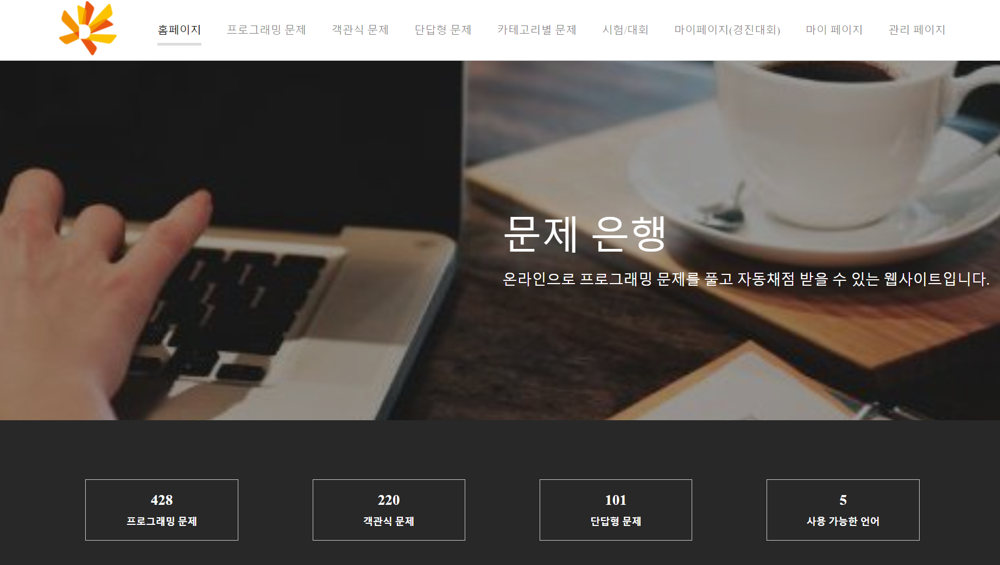</a>
  <br><br><strong>PLASS 문제은행 클라이언트</strong>
</h1>


---
## 소개[](#introduction)
**문제은행 클라이언트**라는 프로젝트는 동국대학교 PLASS 연구실 연구원들이 개발하는 프로젝트입니다.

---

## 목차[](#table-of-contents)
1. [개발 환경](#dev-env)
2. [실행 방법](#install)
3. [기능 명세서](#feature)
3. [개발 멤버](#member)

---

## 개발 환경[](#dev-env)
- [Node.js](https://nodejs.org/)
- [React.js](https://reactjs.org/)

## 설치[](#install)
```bash

# Clone this repository
git clone `` 

# Go into the repository
cd problembank-client 

# Install dependencies
npm start

# .env create env file
vim .env 
REACT_APP_SERVER_API=http://localhost:3003
REACT_APP_SERVER_SCORE_API=http://localhost:5111
REACT_APP_CODE_SERVER=http://localhost

# Run the app
$ npm start
```
> 💡 정상적으로 올리는지 확인: `open https://localhost:3003` 명령어를 사용하여 선호하는 브라우저로 접속하세요. <br>
> 💡 Docker 빌드: `docker build . -t problemblem-client:1.1` 또는 `./build-docker.sh 1.1`

---

## 기능 명세서[](#feature)

#### 로그인 / 페이지를 유입
유저가 Moodle를 통해서 로그인해서 **문제은행** 클릭하면 해당 유저의 토큰을 전달하고 문제은행페이이에서 토큰을 받아서 유저정보를 다시 호출한다.
만약에 전달하는 토큰이 일치하지 않으면 해당 페이지를 나가시킬것이다.

#### 프로그래밍 문제
각 언어가 가지는 프로그래밍 문법과 심화 과정을 문제를 통하여 C++나 Java 등의 객체지향 언어와 절차적 언어 C와 머신러닝 및 AI 교육용 및 개발용으로 주목받고 있는 Python 총 4가지의 언어를 가지며 프로그래밍 문제를 통하여 학습할 수 있음

<div align="center">
  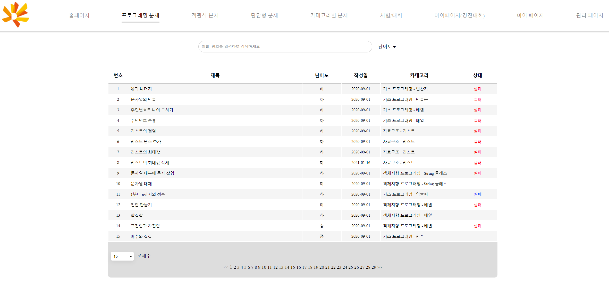
</div>
</br>
원하는 문제를 클릭해서 해당 문제를 상세한 페이지를 이동한다. 이 페이지에서 해당 문제를 여러 정보를 확인 할 수 있으며 문제를 다 풀리게 되면 제출의 답안을 제출 할 수 있다.
</br>
<div align="center">
  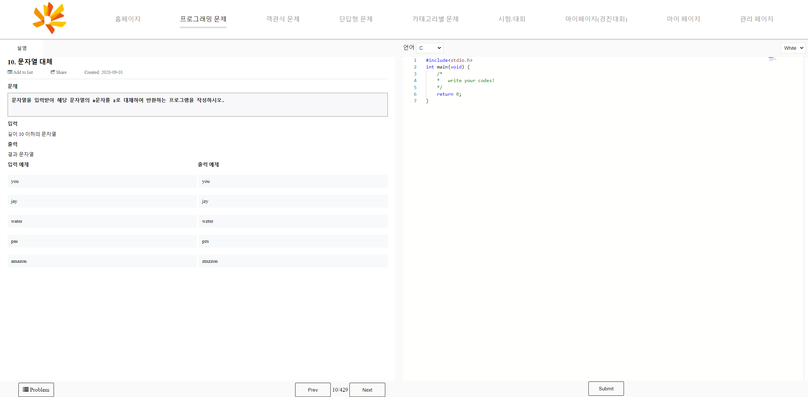
</div>
</br>

#### 객관식 문제
프로그래밍 기본 개념을 학습하기 위해서 여러 객관식 문제들을 제공합니다.
</br>
</br>
<div align="center">
  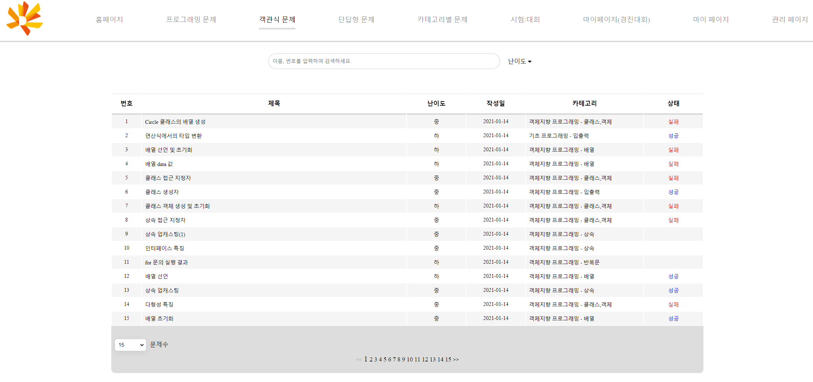
</div>
</br>
</br>
원하는 문제를 클릭해서 해당 문제를 상세한 페이지를 이동한다. 이 페이지에서 해당 문제를 여러 정보를 확인 할 수 있으며 문제를 다 풀리게 되면 제출의 답안을 제출하여 결과를 바로 확인할 수 있다.
</br>
</br>
<div align="center">
  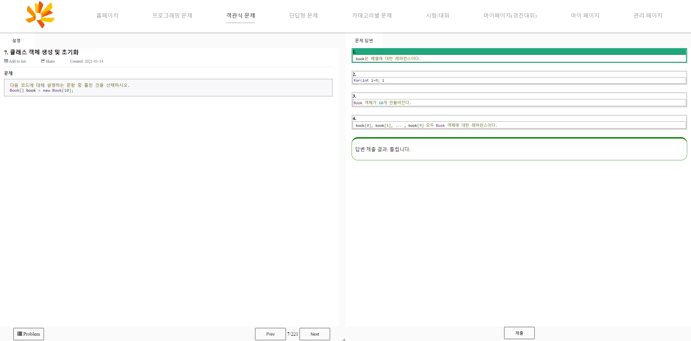
</div>
</br>
</br>

#### 단답형 문제
프로그래밍 기본 개념을 학습하기 위해서 여러 단답형 문제들을 제공합니다.
</br>
</br>
<div align="center">
  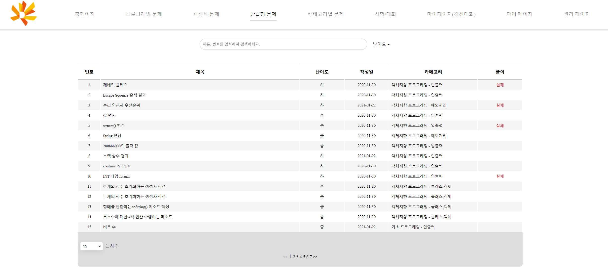
</div>
</br>
</br>
원하는 문제를 클릭해서 해당 문제를 상세한 페이지를 이동한다. 이 페이지에서 해당 문제를 여러 정보를 확인 할 수 있으며 문제를 다 풀리게 되면 제출의 답안을 제출하여 결과를 바로 확인할 수 있다.
</br>
</br>
<div align="center">
  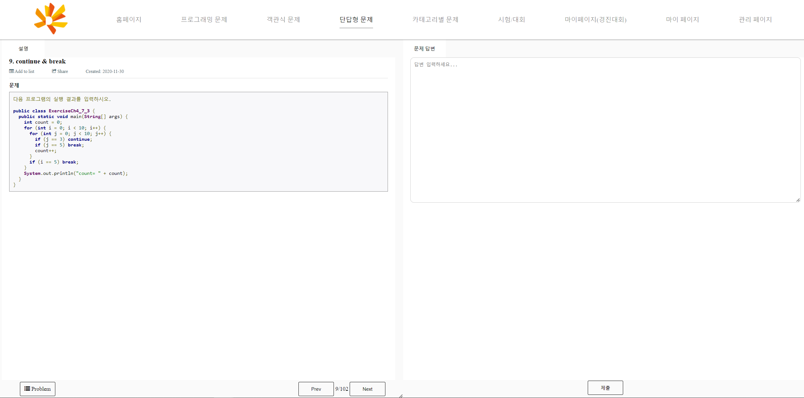
</div>
</br>
</br>

#### 카테고리별 문제
교육과정을 프로그래밍 언어별로 구분하여 기초프로그래밍, 심화 프로그래밍, 객체지향 프로그래밍, 자료구조, 알고리즘 문제로 분리하여 제공합니다.
</br>
</br>
<div align="center">
  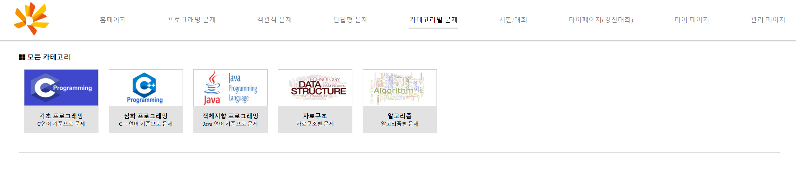
</div>
</br>
</br>
특정한 카테고리를 클릭하면 해당 카테고리가 제공한 서버 카테소리문제별로 문제를 출력합니다.
</br>
</br>
<div align="center">
  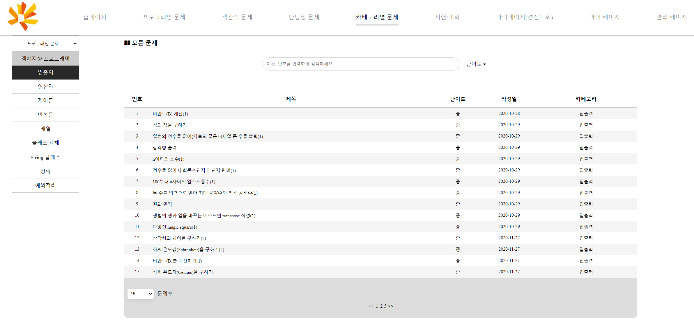
</div>
</br>
</br>

#### 시험/대회
관리자가 등록한 시험/대회를 확인 하는 페이지이며 각 시험/대회의 진행 상태를 확인하여 신청/입장을 할 수 있습니다.
</br>
</br>
<div align="center">
  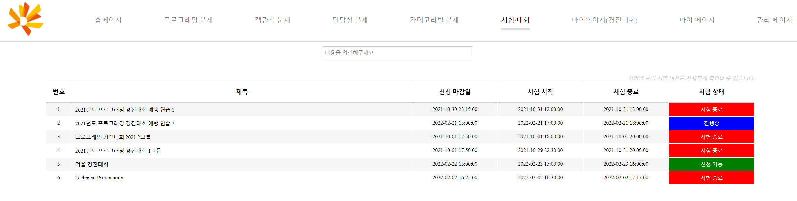
</div>
</br>
</br>

#### 마이페이지(경진대회)
유저가 신청한 시험/대회를 조회하는 페이지
</br>
</br>
<div align="center">
  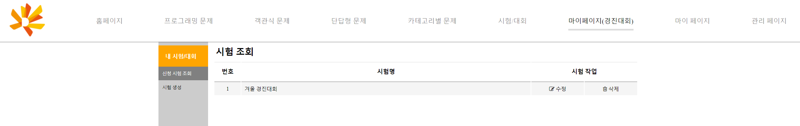
</div>
</br>
</br>

#### 마이 문제
유저가 저장한 문제들을 다시 확인할 수 있씁니다.
</br>
</br>
<div align="center">
  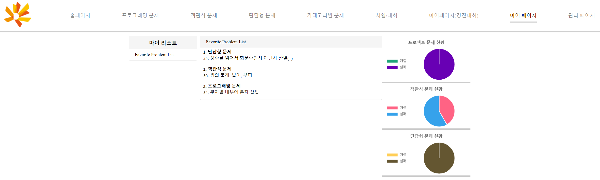
</div>
</br>
</br>

#### 관리 페이지
관리자인 경우에는 모든 문제 유형을 등록/수정/삭제를 할 수 있습니다.
</br>
</br>
<div align="center">
  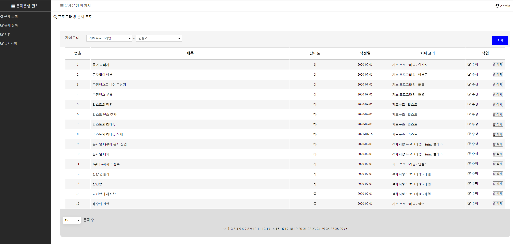
</div>
</br>
</br>

## 개발 멤버[](#member)
- 동국대학교 PLASS 연구실 연구원

<h1 align="center" style="display: block; font-size: 2.5em; font-weight: bold; margin-block-start: 1em; margin-block-end: 1em;">
END
</h1>